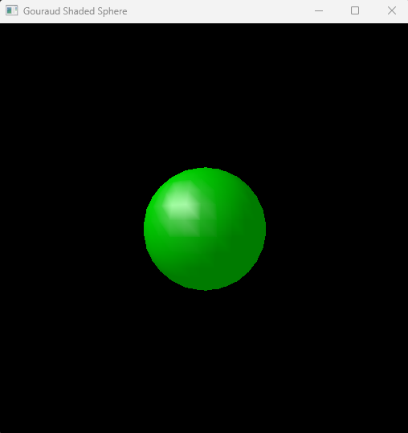
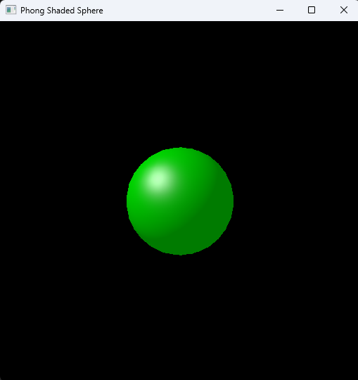

# HW6 - Shaded Sphere Renderer

## 🧾 Description

This project implements software rasterization of a sphere with three shading techniques:

- **Flat Shading** (per-triangle normal)
- **Gouraud Shading** (per-vertex normal and color interpolation)
- **Phong Shading** (per-fragment normal interpolation)

All rendering is done on the own rasterizer, with the final image displayed via `glDrawPixels`.

---

## 🎯 Assignment Requirements

- ✔ Used HW5's transformation and rasterization pipeline.
- ✔ Material parameters:
  - `ka = (0, 1, 0)`
  - `kd = (0, 0.5, 0)`
  - `ks = (0.5, 0.5, 0.5)`
  - `p = 32` (shininess)
- ✔ Ambient light intensity: `Ia = 0.2`
- ✔ Point light: `(-4, 4, -3)` with white unit intensity and no falloff.
- ✔ Gamma correction applied with γ = 2.2.
- ✔ Used the appropriate interpolation and lighting stage for each shading method:
  - Flat: color computed **once per triangle**
  - Gouraud: color computed **per vertex**, interpolated across the triangle
  - Phong: normal interpolated **per pixel**, lighting computed per-fragment

---
## 🖥️ Build & Run Instructions

### ✅ Prerequisites
- Visual Studio Community 2022
- GLFW, GLEW, OpenGL (already linked)

### 📂 Project Structure
One solution `OpenglViewer.sln` with three projects:
- `HW6Q1`: Flat shading
- `HW6Q2`: Gouraud shading
- `HW6Q3`: Phong shading

Each project shares the transformation and rasterization code but implements the shading logic differently.

---

### 🧪 Run Steps
1. Clone the repository
```bash
git clone https://github.com/tuguldur77/CG_HW6_202213827.git
cd CG_HW6_202213827
```

2. Open `OpenglViewer.sln` in Visual Studio.
3. Set `HW6Q1`, `HW6Q2`, or `HW6Q3` as **StartUp Project** depending on shading mode.
4. Press **Ctrl + F5** to build and run.
5. Output window will display a shaded sphere. Press `ESC` or `Q` to exit.

---

### 📸 Output Image
Each program draws a 512x512 sphere with different lighting styles.
## 📷 Screenshots

<table>
  <tr>
    <th>Flat Shading</th>
    <th>Gouraud Shading</th>
    <th>Phong Shading</th>
  </tr>
  <tr>
    <td></td>
    <td></td>
    <td></td>
  </tr>
</table>


---

## ✍️ Author
Computer Graphics – Spring 2025 – Assignment 6, Konkuk University
Maintainer: Tuguldur SID-202213827
